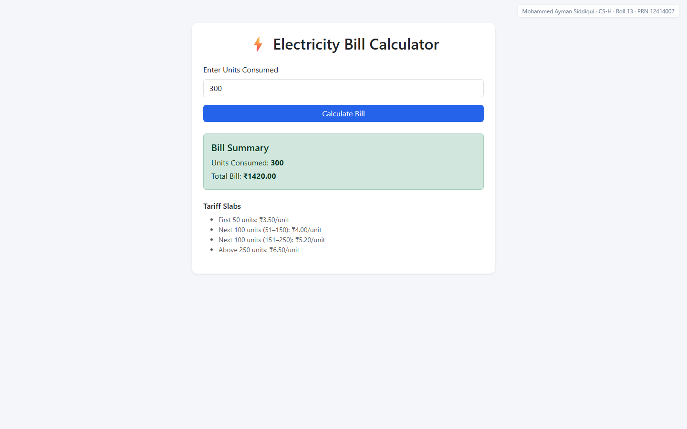

# Electricity Bill Calculator (Servlet + JSP)

A responsive web application that calculates electricity bills using a tiered/slab-based tariff system, built using Java Servlets, JSP, and Bootstrap, running on Apache Tomcat.

## Features

- User inputs electricity units consumed
- Bill calculated server-side using a Java Servlet
- 4-tier slab-based tariff calculation
- Client-side validation (HTML5 min/required attributes)
- Server-side validation in the Servlet
- Clean, responsive UI using Bootstrap 5 and JSP

## Tariff Structure

| Units | Rate |
|---|---|
| First 50 units | ₹3.50/unit |
| Next 100 units (51–150) | ₹4.00/unit |
| Next 100 units (151–250) | ₹5.20/unit |
| Above 250 units | ₹6.50/unit |

## Technologies Used

- Java 21
- Jakarta Servlet API 6.0
- JSP (Jakarta Server Pages)
- Apache Tomcat 10.1.59
- Maven (build tool)
- Bootstrap 5

## Project Structure

```text
src/main/
├── java/com/electricitybill/
│   └── BillServlet.java      (handles calculation logic)
├── resources/
└── webapp/
    ├── WEB-INF/
    │   └── web.xml            (deployment descriptor)
    ├── index.jsp               (UI/view)
    └── style.css
```

## Installation & Setup

1. Install JDK 21+
2. Install Apache Tomcat 10.1.x
3. Clone this repository
4. Open in IntelliJ IDEA (or any IDE with Maven + Tomcat support)
5. Configure a Tomcat run configuration pointing to your local Tomcat installation
6. Set the deployment context path to `/electricity-bill-servlet-jsp`
7. Run the project — it will build a WAR file and deploy it to Tomcat

## How to Use

1. Visit `http://localhost:8080/electricity-bill-servlet-jsp/`
2. Enter the number of electricity units consumed
3. Click "Calculate Bill"
4. View the calculated bill and tariff breakdown

## Testing

Verified against the following boundary values:

| Units | Expected Bill |
|---|---|
| 0 | ₹0.00 |
| 1 | ₹3.50 |
| 50 | ₹175.00 |
| 51 | ₹179.00 |
| 150 | ₹575.00 |
| 151 | ₹580.20 |
| 250 | ₹1095.00 |
| 251 | ₹1101.50 |
| 300 | ₹1420.00 |

## Future Improvements

- Add database logging of past bills
- Support multiple tariff plans
- Add unit tests using JUnit

## Screenshots



